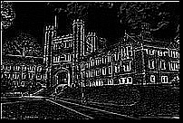

# Image Processing - Without OpenCv

Hey , I have been using OpenCv extensively for the past few months and I thought its time for my own implementation of the Image Processing Filters using python.

## Input Images
 

# Filters: 
## 1. Brightness 

  
Image 1 : Brightness Factor = 0 
Image 2 : Brightness Factor = 0.5 
Image 3 : Brightness Factor = 2.0

## 2. Blurr
Image 1 : Blurr Factor = 0.125 
Image 2 : Blurr Factor = 2
Image 3 : Blurr Factor = 8
  

## 3. Edge Detection

## 4. Sharpen

## 5. Contrast

